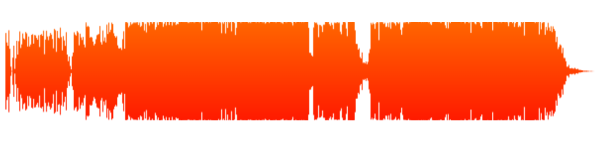

waveform
========

This is a demo for testing [waveform.js](http://waveformjs.org/).

Install [wave2json](https://github.com/beschulz/wav2json) first and run command below, your will get file called `song.json`

```bash
$ ./conv2json xxx.[mp3|m4a] 
```

visit the `index.html` you will see something like this.


